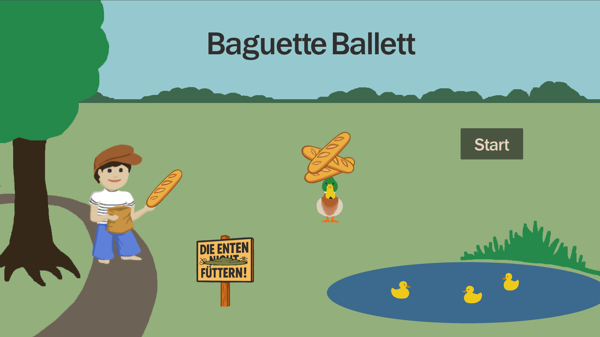
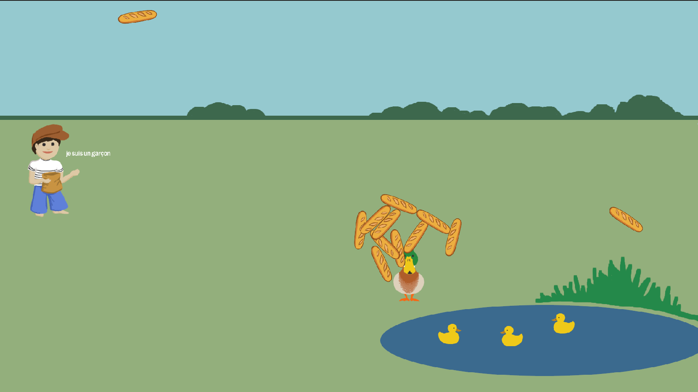

# Baguette Ballett

### Mother duck needs to feed her children and luckily a boy throws bread to her

Of course, humans know that bread isn't good for ducks - but mother duck knows better!

Help her feed her ducklings, don't let the bread mold and don't let it fall, those little ducklings are very hungry!

This game was made during the [Hetzner Game Jam 2025](https://github.com/hetzneronline/game-jam) in 48 hours.

It is licensed under GNU Affero General Public License version 3 or later.

Thanks to [Hetzner](https://hetzner.com) for organizing this event.

**🎮 Play it online on [baguetteballett.de](https://baguetteballett.de)**

## Downloads
* [Linux](https://baguetteballett.de/baguette-ballett.x86_64)
* [Windows](https://baguetteballett.de/baguette-ballett.exe)

## Credits
* [Godot Engine](https://docs.godotengine.org/en/stable/index.html)
* [ChatGPT](https://chatgpt.com)
