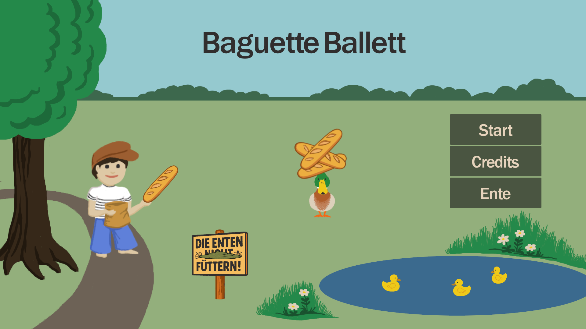
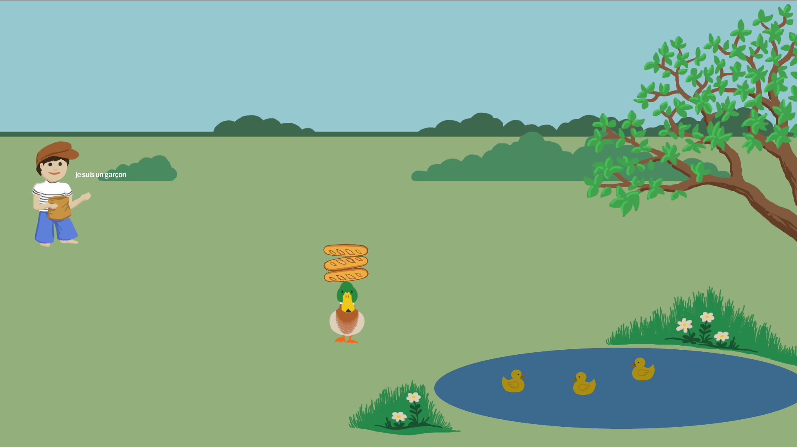

# Baguette Ballett

Mother duck needs to feed her children[^children] and luckily there's a boy[^boy] with lots of baguettes.

Be efficient and _balance_ the baguettes on your head, so you need fewer trips to the pond to feed your ducklings. Running around with a stack of baguettes on your head requires precision and poise, just like in ballet practice.

Don't let the bread go moldy[^moldy] and don't let it fall[^fall], those little ducklings are very hungry!

[^boy]: his name is probably Francois or Jacques, definitely very French
[^children]: see if we actually implemented ducklings in issues [#18](https://github.com/baguette-ballett/baguette-ballett/issues/18) and [#19](https://github.com/baguette-ballett/baguette-ballett/issues/19)
[^moldy]: see if we actually implemented moldy bread in issue [#21](https://github.com/baguette-ballett/baguette-ballett/issues/21)
[^fall]: dropped bread is lost forever, so be careful to catch it

This game was made during the [Hetzner Game Jam 2025](https://github.com/hetzneronline/game-jam) in 48 hours.

It is licensed under GNU Affero General Public License version 3 or later.

Thanks to [Hetzner](https://hetzner.com) for organizing this event.

**🎮 Play it online on [baguetteballett.de](https://baguetteballett.de)**

## Downloads
* [Linux](https://baguetteballett.de/baguette-ballett.x86_64)
* [Windows](https://baguetteballett.de/baguette-ballett.exe)

## Credits
* [Godot Engine](https://docs.godotengine.org/en/stable/index.html)
* [ChatGPT](https://chatgpt.com)
* [Xeno Canto](https://xeno-canto.org/785938)
* "Sergio's Magic Dustbin"
  Kevin MacLeod (incompetech.com)
  Licensed under Creative Commons: By Attribution 3.0
  http://creativecommons.org/licenses/by/3.0/
* [Font Franklin Gothic Medium](https://fontmeme.com/schriftarten/franklin-gothic-medium-schriftart/) from [OPTIFONT on fontmeme.com](https://fontmeme.com/schriftarten/optifont-listing/)
